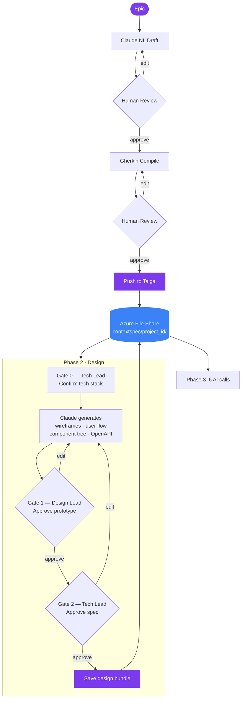

# Apex

Apex guides a software team through the SDLC using Claude AI and Taiga. It enforces a **Spec-Anchored** workflow: every phase is gated on human-approved artefacts from the previous one, and a shared context file store feeds every AI call.

**Stack:** FastAPI · Next.js · TypeScript · React Query · Zustand · Tailwind CSS · LangChain · Anthropic Claude · Pydantic · azure-storage-file-share


## How it works



---

## What's implemented

### Phase 1 · Requirements

- FastAPI endpoints for loading epics, suggesting epics, generating Natural Language drafts, compiling Gherkin, and pushing locked stories to Taiga
- Next.js workflow: Create New, Load from Taiga, and AI Suggests modes
- NL draft review/edit flow
- Gherkin compile/review flow
- Push to Taiga; approved Gherkin saved to `functional-spec.md`
- Story index entries compatible with Phase 2 (`gherkin_locked`)

### Phase 2 · Design

**Stage A · Tech Stack (Gate 0 — Tech Lead)**
- FastAPI endpoint proposes ranked architectural alternatives from all locked Gherkin stories
- Tech Lead selects/edits/locks the chosen stack into `memory-bank.md`

**Stage B · Epic Design Bundle (Gate 1 + Gate 2)**
- Select any epic with at least one `gherkin_locked` story
- Claude generates a full design bundle: ASCII wireframes, Mermaid user flow diagram, component tree, unified OpenAPI/DB schema spec
- Locked Tech Stack injected as a binding constraint
- Cross-epic consistency: prior locked bundles injected into the AI prompt
- UX / System Architecture tabs render the generated bundle
- Gate 1 (Design Lead): approve wireframes + flow + component tree
- Gate 2 (Tech Lead): approve OpenAPI/DB spec
- Locking writes `technical-spec.md`, `design-bundle.md`, Memory Bank design decisions, and updates Taiga/story index status

### Sidebar

- Resizable, collapsible sidebar with light/dark modes
- Taiga token and username/password login; "Create a Taiga account" link
- Project selector; project create/delete
- Epics & Stories board; epic/story create/delete/edit
- Users & Roles with invite, remove, and role change
- Active Context file editing (memory-bank, functional-spec, technical-spec, vaccines, design-bundle)
- AI model selector (fast model + coder model, persisted in `.apex-config.json`)
- Resources section with Taiga documentation links and a direct link to your Taiga instance

### Phases 3–6

Navigation stubs (Implementation, Testing, Deployment, Maintenance) present; workflows not yet implemented.

---

## Architecture

| File / folder | Role |
|---|---|
| `backend/app/main.py` | FastAPI entry point, CORS, router registration |
| `backend/app/api/phase1.py` | Phase 1 Requirements REST API |
| `backend/app/api/phase2.py` | Phase 2 Design REST API |
| `backend/app/api/workspace.py` | Sidebar/workspace APIs: auth, projects, board, users, context files, AI config |
| `backend/app/services/` | Service layer wrapping AI, Taiga, context, and phase workflows |
| `backend/app/schemas/` | Pydantic request/response contracts |
| `frontend/app/` | Next.js App Router routes and global providers |
| `frontend/components/` | App shell, sidebar, phase navigation, Phase 1 and Phase 2 workflow screens |
| `frontend/lib/api/` | Typed frontend API clients |
| `frontend/lib/hooks/` | React Query hooks |
| `frontend/lib/stores/` | Zustand session, UI, and Phase 2 draft state |
| `src/ai_engine.py` | LangChain + Claude prompts and structured outputs |
| `src/context_manager.py` | Reads/writes context files via `StoragePath` (Azure or local) |
| `src/storage.py` | `StoragePath` — pathlib-compatible wrapper; delegates to Azure File Share SDK or local disk |
| `src/taiga_adapter.py` | Taiga REST API client |
| `tests/` | Pytest suite — all external APIs mocked |

---

## Running locally

### Prerequisites

| Requirement | Notes |
|---|---|
| Python 3.12 | |
| Node.js 20+ | |
| Anthropic API key | Required — set in `.env` |
| Taiga account | Optional upfront — sign in via the sidebar |

### 1 · Environment setup

```bash
cp .env.example .env
```

Edit `.env`:

```env
ANTHROPIC_API_KEY=sk-ant-...

# Azure File Share — syncs context files between local dev and the deployed app.
# Leave blank to use a local contextspec/ folder instead.
AZURE_STORAGE_CONNECTION_STRING=DefaultEndpointsProtocol=https;AccountName=...
AZURE_FILE_SHARE_NAME=contextspec

TAIGA_API_URL=https://api.taiga.io

# Optional model overrides (also configurable in the sidebar):
# AI_MODEL_FAST=claude-haiku-4-5-20251001
# AI_MODEL_CODER=claude-sonnet-4-6

# Next.js frontend:
NEXT_PUBLIC_API_BASE_URL=http://localhost:8000
```

> **Never commit `.env`.** It is listed in `.gitignore`.

#### Azure File Share (optional)

When `AZURE_STORAGE_CONNECTION_STRING` is set, context reads/writes go through the Azure File Share SDK — the same share the deployed Container App mounts. Local dev and the deployed instance share the same context files. Without it the app uses a local `contextspec/` folder.

### 2 · Split-stack dev

```bash
pip install -r requirements.txt

# terminal 1
uvicorn backend.app.main:app --reload --host 0.0.0.0 --port 8000

# terminal 2
cd frontend
npm ci
npm run dev
```

Open [http://localhost:3000](http://localhost:3000). Backend health check at `/api/health`.

### 3 · Docker Compose

```bash
docker compose up --build
```

Backend on port 8000, frontend on port 3000.

```bash
docker compose down
```

---

## Deployment (Azure Container Apps)

The app is live at **[https://apex-bolt.com](https://apex-bolt.com)**, deployed on Azure Container Apps in France Central.

Two separate Container Apps:

- `apex-backend` — FastAPI, port 8000
- `apex-frontend` — Next.js, port 3000

Set frontend `NEXT_PUBLIC_API_BASE_URL` to the backend ingress URL. Mount the Azure File Share only into the backend at `/app/contextspec`.

### Infrastructure

| Resource | Name | Purpose |
|---|---|---|
| Container App | `apex-backend` | FastAPI backend |
| Container App | `apex-frontend` | Next.js frontend |
| Container App Environment | `apex-env` | Networking and shared config |
| Storage Account | `apexctxstore` | Azure File Share for context files |
| File Share | `contextspec` | Mounted at `/app/contextspec` in the backend |
| Log Analytics Workspace | `apex-logs` | Log aggregation |
| Application Insights | `apex-insights` | Monitoring, error tracking, live metrics |
| Recovery Services Vault | `apex-backup-vault` | Daily backup of the file share (30-day retention) |
| Resource Group | `apex-rg` | All resources, France Central region |

### Context persistence

Context files live in the Azure File Share under `<taiga_project_id>/` (e.g. `1786966/memory-bank.md`). Each Taiga project gets its own subdirectory — context never bleeds between projects.

The frontend stores the Taiga token and active project in Zustand local storage and sends them to FastAPI as:

- `Authorization: Bearer <taiga_token>`
- `X-Taiga-Project-Id: <project_id>`

### CI/CD

Every push to `main` automatically:
1. Runs the full Python test suite
2. Typechecks and builds the Next.js frontend
3. Builds and pushes backend and frontend Docker images to `ghcr.io`
4. Deploys both Container Apps

### Monitoring

```kusto
// Errors in the last 24 h
exceptions
| where timestamp > ago(24h)
| project timestamp, type, outerMessage
| order by timestamp desc

// App log messages
traces
| where timestamp > ago(24h)
| project timestamp, message, severityLevel
| order by timestamp desc
```

---

## Tests

```bash
python3 -m pytest tests/ -v --tb=short
```

Frontend checks:

```bash
cd frontend
npm ci
npm run typecheck
npm run build
```
