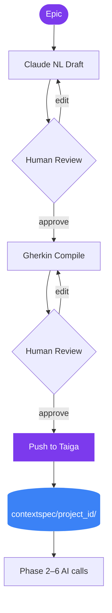

# Apex

Apex is a Reflex web application that guides a software team through the SDLC using Claude AI and Taiga. It turns an Epic into formal Gherkin acceptance criteria, pushes stories to Taiga, and keeps the approved requirements in a persistent context that feeds every subsequent phase.


## How it works



1. Open Phase 1 and enter or select a Taiga Epic (or use **AI Suggests** to generate candidates from your Project Concept).
2. Claude generates a Natural Language story draft.
3. Review and edit the draft in the UI.
4. The app compiles the draft into strict Gherkin acceptance criteria.
5. Edit story titles and Gherkin per story, then confirm the push.
6. Stories are created in Taiga and the approved Gherkin is written to `contextspec/<project_id>/`.

## What's implemented

### Phase 1 · Requirements (full)

- Load or create a Taiga Epic; browse and select from existing epics
- Generate Natural Language user stories via Claude (with AI guidance field)
- Gated on Taiga sign-in, active project, and Project Concept — each missing prerequisite shows a targeted warning
- Edit the NL draft interactively before locking it in
- Compile the draft into formal Gherkin acceptance criteria
- Edit story titles, sizes, and Gherkin per story before pushing
- Push stories to Taiga with tags and board status
- Save the approved Gherkin to `contextspec/<project_id>/functional-spec.md`
- Draft survives page refresh via `.apex-draft.json` (restored from browser cookie)
- **AI Suggests** — generate 5–10 scoped Epic candidates from the Project Concept

### Sidebar

- **Settings & Connections** — AI model status, Taiga account (⇄ switch), project selector, Epics & Stories board, Users & Roles
- **Active Context** — live editor for Memory Bank, Functional Spec, Technical Spec, Vaccine Records (scoped to the active project)
- **SDLC Phases** — phase navigation

### Phases 2–6

Present in the UI as navigation stubs: Design, Implementation, Testing, Deployment, Maintenance.

## Architecture

| File / folder | Role |
|---|---|
| `apex/apex.py` | App entry point — `rx.App`, route registration, on_load handlers |
| `apex/state/auth.py` | `AuthState` — Taiga token in `rx.Cookie`, login/logout, theme pref in `rx.LocalStorage` |
| `apex/state/project.py` | `ProjectState` — active project ID, project list, config persistence |
| `apex/state/phase1.py` | `Phase1State` — full Phase 1 workflow vars and event handlers |
| `apex/state/board.py` | `BoardState` — Epics & Stories board, CRUD, dialog state |
| `apex/state/context.py` | `ContextState` — context file editors (Memory Bank, Functional Spec, etc.) |
| `apex/state/user_mgmt.py` | `UserMgmtState` — member list, roles, invite |
| `apex/pages/` | One page function per phase, referenced by `apex.py` |
| `apex/components/` | Sidebar, nav, phase 1 step components, dialogs |
| `src/ai_engine.py` | LangChain + Claude prompts and structured outputs |
| `src/context_manager.py` | Reads/writes `contextspec/<project_id>/` markdown files |
| `src/taiga_adapter.py` | Taiga REST API client (GET/POST/PATCH/DELETE) |
| `rxconfig.py` | Reflex config — ports, theme plugin |
| `contextspec/` | Persistent project context — one subdirectory per Taiga project ID |
| `tests/` | Pytest test suite — 221 tests, all external APIs mocked |

## Tech stack

Python 3.12 · Reflex 0.9 · LangChain · Anthropic Claude · Pydantic · Requests · python-dotenv · azure-monitor-opentelemetry

---

## Running locally

### Prerequisites

| Requirement | Notes |
|---|---|
| Python 3.11+ | 3.10 works but is deprecated by Reflex |
| Node.js 20+ | Required by Reflex for the React frontend build |
| Docker 24+ | For container run |
| Anthropic API key | Required — set in `.env` |
| Taiga account | Optional upfront — sign in via the sidebar ⇄ button on first launch |

### 1 · Environment setup

Only the Anthropic key is needed upfront. Taiga credentials are entered via the sidebar on first use.

```bash
cp .env.example .env
```

Edit `.env`:

```env
ANTHROPIC_API_KEY=sk-ant-...

# Taiga — filled automatically by the app when you sign in via the sidebar:
# TAIGA_API_URL=https://api.taiga.io
# TAIGA_PROJECT_ID=
# TAIGA_AUTH_TOKEN=

# Optional model overrides
# AI_MODEL_FAST=claude-haiku-4-5-20251001
# AI_MODEL_CODER=claude-sonnet-4-6

# Optional — enables Application Insights telemetry (Azure deployment only):
# APPLICATIONINSIGHTS_CONNECTION_STRING=InstrumentationKey=...
```

> **Never commit `.env`.** It is listed in `.gitignore`.

### 2 · Local dev server

```bash
pip install -r requirements.txt
reflex run
```

Open [http://localhost:3000](http://localhost:3000). The backend API runs on [http://localhost:8000](http://localhost:8000).

### 3 · Docker Compose (recommended for production-like testing)

```bash
docker compose up --build
```

Compose reads `.env` automatically and mounts `contextspec/` as a volume. Open [http://localhost:3000](http://localhost:3000).

```bash
docker compose down   # stop
```

### 4 · Docker (manual)

```bash
docker build -t apex:local .

docker run -e ANTHROPIC_API_KEY=sk-ant-... \
  -p 3000:3000 -p 8000:8000 \
  -v "$(pwd)/contextspec:/app/contextspec" \
  apex:local
```

---

## Deployment (Azure Container Apps)

The app is live at **[https://apex-bolt.com](https://apex-bolt.com)**, deployed on Azure Container Apps in France Central.

### Infrastructure

| Resource | Name | Purpose |
|---|---|---|
| Container App | `apex` | Runs the Reflex application |
| Container App Environment | `apex-env` | Networking and shared config |
| Storage Account | `apexctxstore` | Azure File Share for `contextspec/` |
| File Share | `contextspec` | Mounted at `/app/contextspec` in the container |
| Log Analytics Workspace | `apex-logs` | Log aggregation backend |
| Application Insights | `apex-insights` | Monitoring, error tracking, live metrics |
| Recovery Services Vault | `apex-backup-vault` | Daily backup of the file share (30-day retention) |
| Resource Group | `apex-rg` | All resources, France Central region |

### Ports

In production mode (`reflex run --env prod`) the Python backend at port **8000** also serves the pre-compiled React frontend as static files. Only port 8000 needs to be exposed externally. Azure Container App ingress is set to `--target-port 8000`.

### Custom domain

`apex-bolt.com` and `www.apex-bolt.com` are bound to the Container App with Azure-managed TLS certificates (auto-renewed).

### Context persistence

Context files are stored in `contextspec/<taiga_project_id>/` on the Azure File Share, mounted as a persistent volume. Each Taiga project gets its own subdirectory so context never bleeds between projects.

Taiga auth tokens are stored as an `rx.Cookie` (`apex_session`, 7-day TTL) — they live in the browser and are sent with every WebSocket connection. Page refreshes and new tabs restore auth instantly without a round-trip to any server-side session store.

### CI/CD

Every push to `main` automatically:
1. Runs the test suite
2. Builds and pushes the Docker image to `ghcr.io`
3. Deploys the new revision to Azure

### Monitoring (Application Insights)

```kusto
// Errors in the last 24 h
exceptions
| where timestamp > ago(24h)
| project timestamp, type, outerMessage
| order by timestamp desc

// App log messages
traces
| where timestamp > ago(24h)
| project timestamp, message, severityLevel
| order by timestamp desc
```

---

## Tests

All external APIs are mocked — no real credentials needed:

```bash
pip install -r requirements.txt
python3 -m pytest tests/ -v
```

221 tests across `test_ai_engine.py`, `test_context_manager.py`, `test_phase1.py`, and `test_taiga_adapter.py`.
