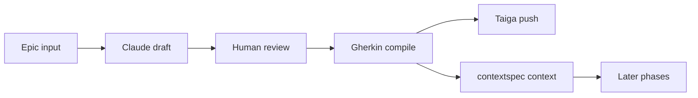

# bolt

bolt is a Streamlit app for turning an Epic into Taiga work while keeping the approved requirements in local markdown context.


## Simple Diagram



## Tech Stack

- Python 3.11+
- Streamlit for the UI
- LangChain + Anthropic Claude for generation and compilation
- Requests for Taiga REST calls
- Pydantic for structured AI outputs
- python-dotenv for local configuration loading

## What Works Now

### Phase 1 · Requirements

This is the implemented workflow.

- load or create a Taiga Epic
- generate Natural Language user stories from the Epic
- edit the draft before locking it in
- compile the draft into formal Gherkin
- edit story titles and Gherkin per story
- push stories to Taiga
- save the approved Gherkin into `contextspec/functional-spec.md`

### Phases 2 to 6

These pages are present in the UI, but they are placeholders for now:

- Design
- Implementation
- Testing
- Deployment
- Maintenance

## Architecture

The app is split into a few focused modules:

- `app.py` sets up Streamlit, injects styling, and routes between pages
- `components/sidebar.py` renders navigation, status, and the live context editor
- `components/phase1.py` contains the full Phase 1 workflow
- `ai_engine.py` wraps Claude prompts and structured outputs
- `context_manager.py` manages the `contextspec/` markdown files
- `taiga_adapter.py` handles Taiga API reads and writes
- `views/` contains thin Streamlit page wrappers

The main design choice is to keep the approved spec in files, not only in memory. That makes later phases able to reuse the locked context.

## How It Works

1. The user opens Phase 1 and enters or selects an Epic.
2. The app asks Claude to generate a Natural Language story draft.
3. The user edits the draft in the UI.
4. The app compiles the draft into strict Gherkin.
5. The user edits the compiled stories and confirms the push.
6. The app creates or links the Epic in Taiga, creates the stories, and writes the approved Gherkin into `contextspec/`.

## Project Files

- `app.py` - app entry point
- `ai_engine.py` - AI prompts and formatting helpers
- `context_manager.py` - OpenSpec read/write helpers
- `taiga_adapter.py` - Taiga API client
- `components/` - shared UI and Phase 1 logic
- `views/` - Streamlit pages
- `contextspec/` - persistent project context

## Run It

```bash
pip install -r requirements.txt
streamlit run app.py
```

## Notes

The project is a workflow engine more than a single-purpose UI. Its goal is to keep human-approved requirements, technical decisions, and downstream work synchronized across Taiga and local context.
